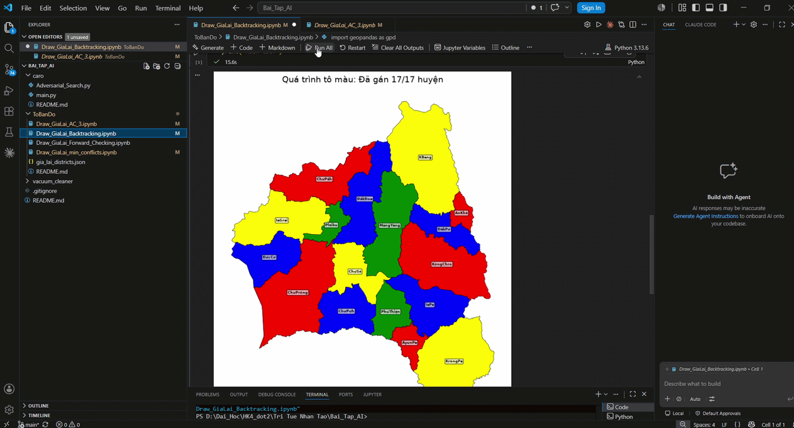
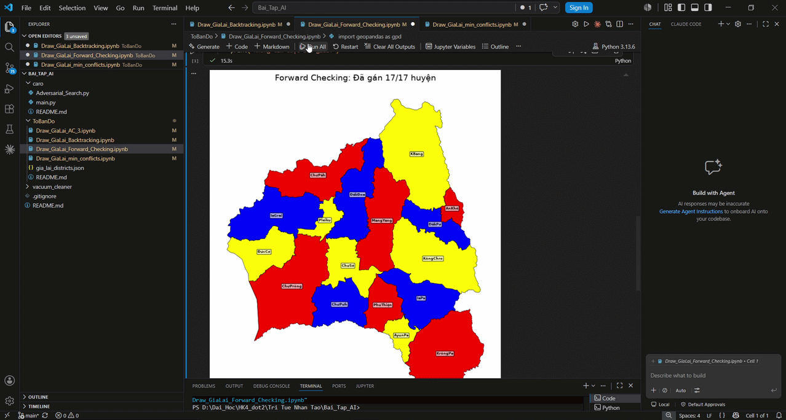
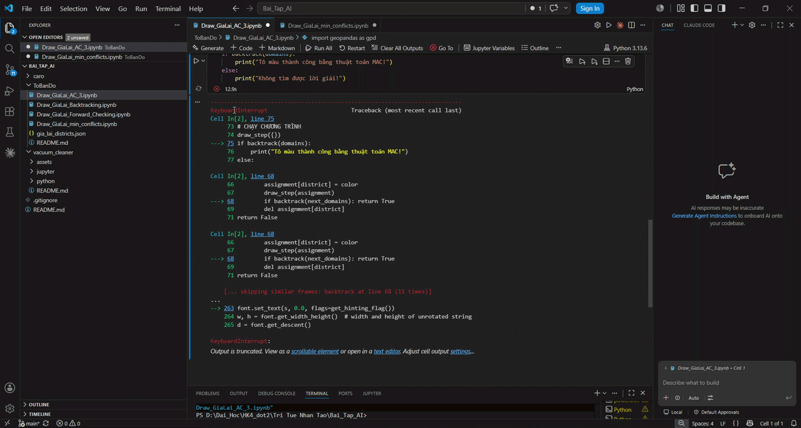
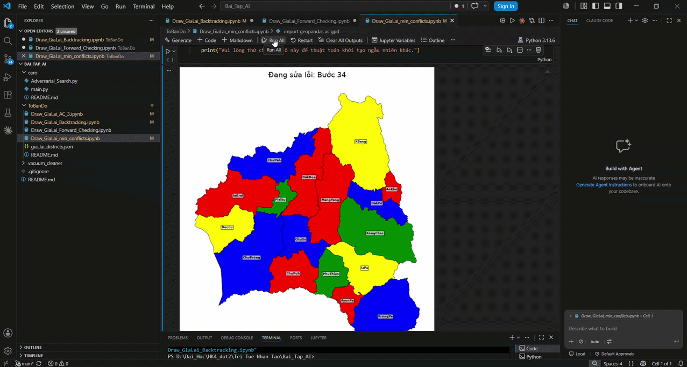

# Giải quyết Bài toán Tô màu Bản đồ Tỉnh Gia Lai bằng các thuật toán CSP

Dự án này là kết quả nghiên cứu và triển khai các thuật toán trong Trí tuệ nhân tạo (AI) nhằm giải quyết bài toán tô màu bản đồ hành chính tỉnh Gia Lai. Mục tiêu là gán màu cho các đơn vị hành chính sao cho không có hai đơn vị kề nhau nào có cùng màu (Constraint Satisfaction Problem - CSP).

## 1. Cấu trúc dự án
Dự án bao gồm các tệp Jupyter Notebook thực nghiệm các thuật toán khác nhau và tệp dữ liệu bản đồ:

* `gia_lai_districts.json`: Dữ liệu GeoJSON chứa thông tin các đơn vị hành chính và tọa độ hình học.
* `Draw_GiaLai_AC_3.ipynb`: Triển khai thuật toán **AC-3 (Arc Consistency)** để tiền xử lý miền giá trị.
* `Draw_GiaLai_Backtracking.ipynb`: Triển khai thuật toán **Quay lui (Backtracking)** cơ bản.
* `Draw_GiaLai_Forward_Checking.ipynb`: Triển khai thuật toán **Kiểm tra trước (Forward Checking)** để tối ưu tìm kiếm.
* `Draw_GiaLai_min_conflicts.ipynb`: Triển khai thuật toán **Min-Conflicts** (tìm kiếm địa phương) để giải quyết xung đột hiệu quả.

## 2. Mô hình bài toán
Bài toán được định nghĩa dựa trên bộ ba $(X, D, C)$:
* **Biến ($X$)**: Tập hợp các đơn vị hành chính (huyện, thị xã, thành phố) thuộc tỉnh Gia Lai.
* **Miền ($D$)**: Tập các màu sắc có thể gán (Ví dụ: 4 màu cơ bản).
* **Ràng buộc ($C$)**: Hai đơn vị hành chính có chung biên giới không được có cùng màu.

## 3. Hướng dẫn cài đặt và sử dụng

### Yêu cầu hệ thống
* Python 3.x
* Các thư viện: `matplotlib`, `networkx`, `numpy`, `json`.

### Cài đặt
Chạy lệnh sau trong terminal để cài đặt các thư viện cần thiết:
```bash
pip install matplotlib networkx numpy
```

Cách chạy chương trình
Clone repository về máy.

Mở các tệp .ipynb bằng Jupyter Notebook hoặc VS Code.

Chạy từng cell trong notebook để xem tiến trình tô màu được trực quan hóa bằng matplotlib.

## 4. Minh hoạ

### Minh hoạ thuật toán Backtracking


### Minh hoạ thuật toán Forward_Checking


### Minh hoạ thuật toán AC_3


### Minh hoạ thuật toán Min_conflicts


## 5. Thông tin tác giả
Sinh viên thực hiện: Nguyễn Quốc Việt

MSSV: 24110381

Đồ án môn học: Trí Tuệ Nhân Tạo