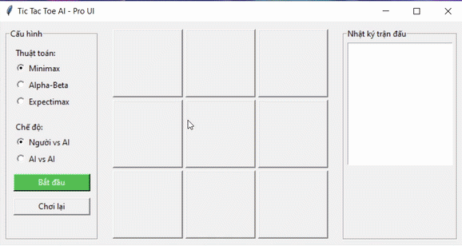
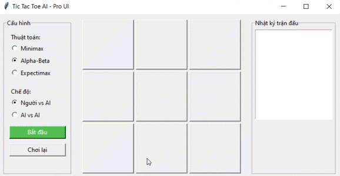
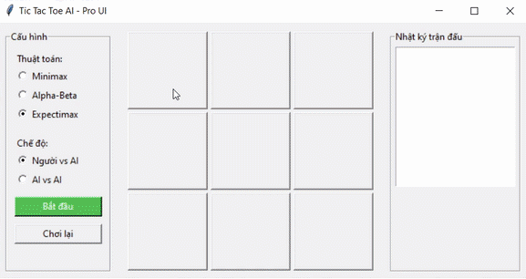
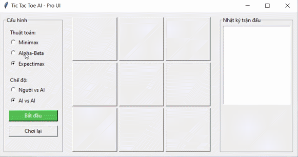
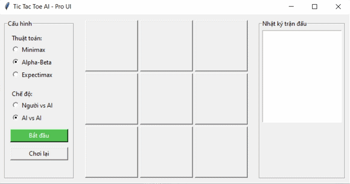
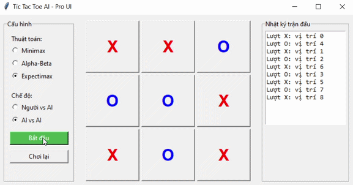

# Bài toán Caro / Tic-Tac-Toe với AI

## 1. Giới thiệu

Dự án mô phỏng trò chơi Caro dạng Tic-Tac-Toe 3x3, trong đó người chơi có thể thi đấu với AI hoặc cho hai AI tự chơi với nhau.

Chương trình sử dụng các thuật toán tìm kiếm đối kháng trong Trí tuệ nhân tạo để lựa chọn nước đi tối ưu cho máy.

## 2. Mục tiêu

- Xây dựng giao diện trực quan bằng Tkinter.
- Biểu diễn bàn cờ dưới dạng danh sách 9 ô.
- Cài đặt AI chơi cờ bằng các thuật toán tìm kiếm đối kháng.
- Cho phép so sánh cách AI ra quyết định giữa Minimax, Alpha-Beta Pruning và Expectimax.
- Ghi lại nhật ký các nước đi trong quá trình chơi.

## 3. Thuật toán sử dụng

### Minimax

Minimax giả định rằng hai người chơi đều chơi tối ưu.

- AI dùng ký hiệu `O` và cố gắng tối đa hóa điểm số.
- Người chơi dùng ký hiệu `X` và được xem như đối thủ cố gắng tối thiểu hóa điểm số của AI.
- Giá trị trạng thái:
  - `1`: AI thắng.
  - `-1`: người chơi thắng.
  - `0`: hòa hoặc chưa có lợi thế kết thúc.

### Alpha-Beta Pruning

Alpha-Beta là phiên bản tối ưu của Minimax.

Thuật toán vẫn cho kết quả giống Minimax trong trường hợp chơi tối ưu, nhưng cắt bỏ các nhánh không cần xét nhờ hai giá trị:

- `alpha`: giá trị tốt nhất hiện tại của người chơi MAX.
- `beta`: giá trị tốt nhất hiện tại của người chơi MIN.

Nhờ đó, thuật toán giảm số trạng thái cần duyệt.

### Expectimax

Expectimax dùng khi đối thủ không nhất thiết chơi tối ưu tuyệt đối.

Thay vì luôn chọn nước đi gây bất lợi nhất cho AI như Minimax, thuật toán tính giá trị kỳ vọng dựa trên xác suất các nước đi có thể xảy ra.

Trong chương trình, các nước đi của đối thủ ở nút chance được giả định có xác suất như nhau.

## 4. Cấu trúc thư mục

```text
caro/
├── Adversarial_Search.py
├── main.py
└── README.md
```

### `Adversarial_Search.py`

Chứa lớp `AIPlayer`, chịu trách nhiệm xử lý logic AI:

- Kiểm tra người thắng.
- Kiểm tra bàn cờ đã đầy chưa.
- Tính utility của trạng thái.
- Cài đặt Minimax.
- Cài đặt Alpha-Beta Pruning.
- Cài đặt Expectimax.

### `main.py`

Chứa lớp `CaroUI`, chịu trách nhiệm xây dựng giao diện và điều khiển luồng chơi:

- Tạo bàn cờ 3x3.
- Cho phép chọn thuật toán.
- Cho phép chọn chế độ chơi.
- Xử lý lượt người chơi.
- Gọi AI để chọn nước đi.
- Hiển thị kết quả và nhật ký trận đấu.

## 5. Cách chạy chương trình

Yêu cầu:

- Python 3.x
- Tkinter

Tkinter thường đã được cài sẵn cùng Python trên Windows.

Chạy chương trình:

```bash
cd caro
python main.py
```

Hoặc chạy từ thư mục gốc của dự án:

```bash
python caro/main.py
```

## 6. Hướng dẫn sử dụng

1. Chọn thuật toán:
   - `Minimax`
   - `Alpha-Beta`
   - `Expectimax`

2. Chọn chế độ chơi:
   - `Người vs AI`: người chơi đi `X`, AI đi `O`.
   - `AI vs AI`: hai AI tự lần lượt đánh với nhau.

3. Nhấn `Bắt đầu` để khởi tạo ván chơi.

4. Trong chế độ `Người vs AI`, người chơi bấm vào ô trống trên bàn cờ để đánh dấu `X`.

5. Nhấn `Chơi lại` để xóa bàn cờ và bắt đầu lại.

## 7. Minh hoạ

## Chế độ người chơi với AI

### Minh hoạ thuật toán Minimax


### Minh hoạ thuật toán Alpha_Beta


### Minh hoạ thuật toán Expectimax


## Chế độ AI với AI

### Minh hoạ thuật toán Minimax


### Minh hoạ thuật toán Alpha_Beta


### Minh hoạ thuật toán Expectimax


## 8. Điều kiện kết thúc

Trò chơi kết thúc khi xảy ra một trong các trường hợp:

- `X` thắng.
- `O` thắng.
- Bàn cờ đầy và không có người thắng, kết quả là hòa.

## 9. Kết quả đạt được

Chương trình đã cài đặt được một trò chơi Caro 3x3 có AI, hỗ trợ nhiều thuật toán tìm kiếm đối kháng và có giao diện để quan sát trực tiếp quá trình AI chọn nước đi.

Thông qua bài này, có thể hiểu rõ hơn cách các thuật toán Minimax, Alpha-Beta Pruning và Expectimax được áp dụng trong trò chơi hai người.
